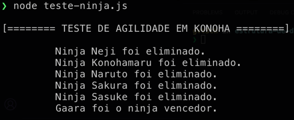

# Filas

- Filas e Pilhas são muito semelhantes em todos os aspectos, porém, existe um grande diferencial que é o princípio que as Filas seguem, o [FIFO (First In First Out)](https://pt.wikipedia.org/wiki/FIFO)

> O princípio é o mesmo que temos na vida real, em uma fila de uma bilheteria de cinema quem chegar primeiro na fila, consequentemente vai comprar o ingresso primeiro e sair para a vinda de outra pessoa com a intenção de comprar também.

- O exemplo de computação é o processamento da fila de impressão de uma impressora, se nós pedirmos ao nosso computador que diga a impressora que temos a intenção de imprimir diversos PDF's, ele irá enfilerar (enqueue) todos nossos pedidos de acordo com a sequência das intenções de impressão.

> quero imprimir este pdf (documento1.pdf) -> enfilera <br>
> quero imprimir estre outro pdf (documento2.pdf) -> enfilera

### Fila de impressão:
> documento2.pdf,documento1.pdf -> imprimir

### Simulando nossa Fila (código):

```
export class Fila {
  constructor() {
    this.count = 0; // auxiliador para tamanho da fila
    this.lowestCount = 0; // primeiro elemento da nossa fila
    this.items = {}; // elementos da fila
  }

  enqueue(element) {
    this.items[this.count] = element;
    this.count++;
  }

  dequeue() {
    if (this.isEmpty()) {
      return undefined;
    }

    const result = this.items[this.lowestCount];
    delete this.items[this.lowestCount];
    this.lowestCount++;
    return result;
  }

  peek() {
    if (this.isEmpty()) {
      return undefined;
    }

    return this.items[this.lowestCount];
  }

  isEmpty() {
    return this.count - this.lowestCount === 0;
  }

  size() {
    return this.count - this.lowestCount;
  }

  clear() {
    this.count = 0;
    this.lowestCount = 0;
    this.items = {};
  }
}

```


### Exercício de Fixação (Corrida Ninja em Konoha)

> Os ninjas de Konoha estão participando de um teste onde deverão tentar levar o mais rápido possível um pergaminho ao ninja que se encontra mais próximo a sua direita durante um determinado período que é contado em segundos aleatoriamente pelo Hokage, quando o Hokage decidir que o tempo acabou uma sirene irá tocar e quem estiver com o pergaminho em mãos será eliminado dando sequência a outra rodada.

### Res:

> {1} Nossa estrutura de dados instânciada para uso. <br>
> {2} Array para armazenar os eliminados a cada rodada.<br>
> {3} Contagem decidida pelo Hokage.<br>
> {4} Estamos enfileirado todos os participantes, isto é, agora todos estão prontos para o teste começar.<br>
> {5} Verificando se há mais de um participante no teste ainda.<br>
> {5.1} Começa a rodada e os participantes são tão ágeis que notamos que o processo roda de forma circular<br>
> {5.2} Ao final do tempo quem estiver com o pergaminho (1 da fila) é eliminado.<br>
> {5.3} o Eliminado é adicionado ao array de eliminados.<br>

```
import { Fila } from "./fila.js";

const testeNinja = (partipantes) => {
  const fila = new Fila(); // {1}
  const eliminados = []; // {2}
  const tempoAleatorio = Math.floor(Math.random() * 59); // {3}

  for (let i = 0; i < partipantes.length; i++) { // {4}
    fila.enqueue(partipantes[i]);
  }

  while (fila.size() > 1) { // {5}
    for (let i = 0; i < tempoAleatorio; i++) { // {5.1}
      fila.enqueue(fila.dequeue()); // {5.2}
    }

    eliminados.push(fila.dequeue()) // {5.3}
  }

  return {
    eliminados,
    vencedor: fila.dequeue()
  }
}

const participantes = ['Sasuke', 'Naruto', 'Sakura', 'Neji', 'Gaara', 'Konohamaru'];
const resultado = testeNinja(participantes);

resultado.eliminados.forEach(participante => {
  console.log(`Ninja ${participante} foi eliminado.`);
});

console.log(`${resultado.vencedor} foi o ninja vencedor.`)
```

<div align="center">
  
</div>

- [seguir para a leitura de Deques](/deques/documentacao.md)
